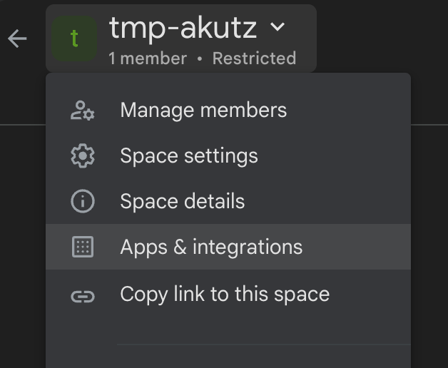
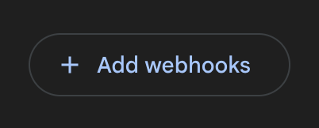
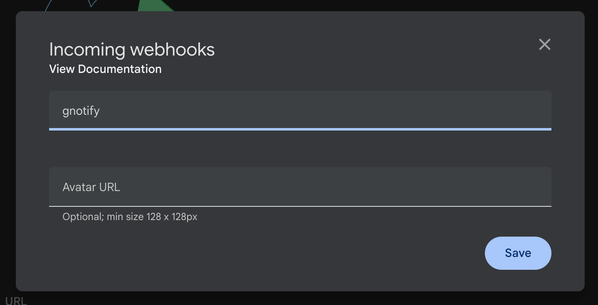
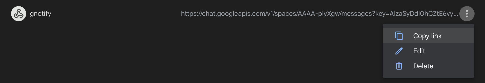
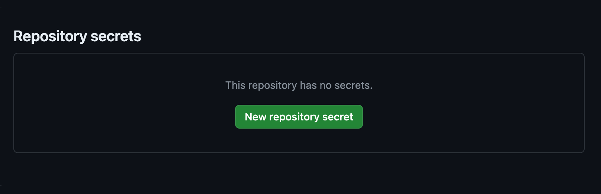
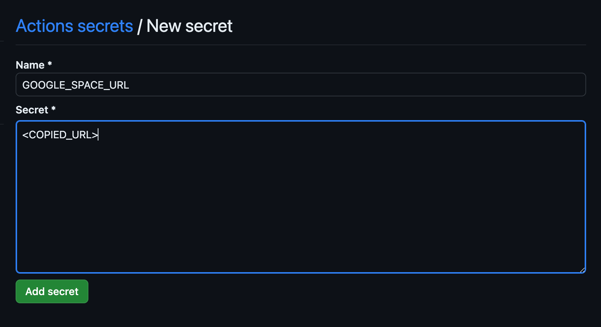
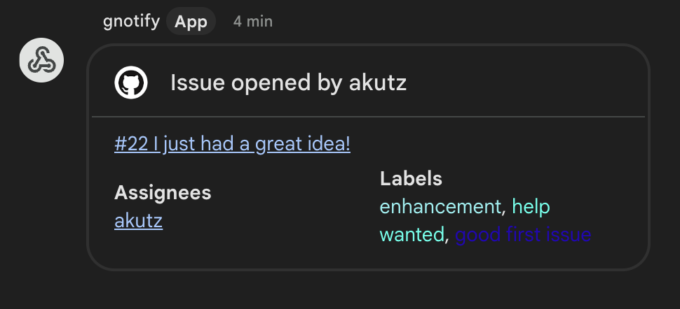
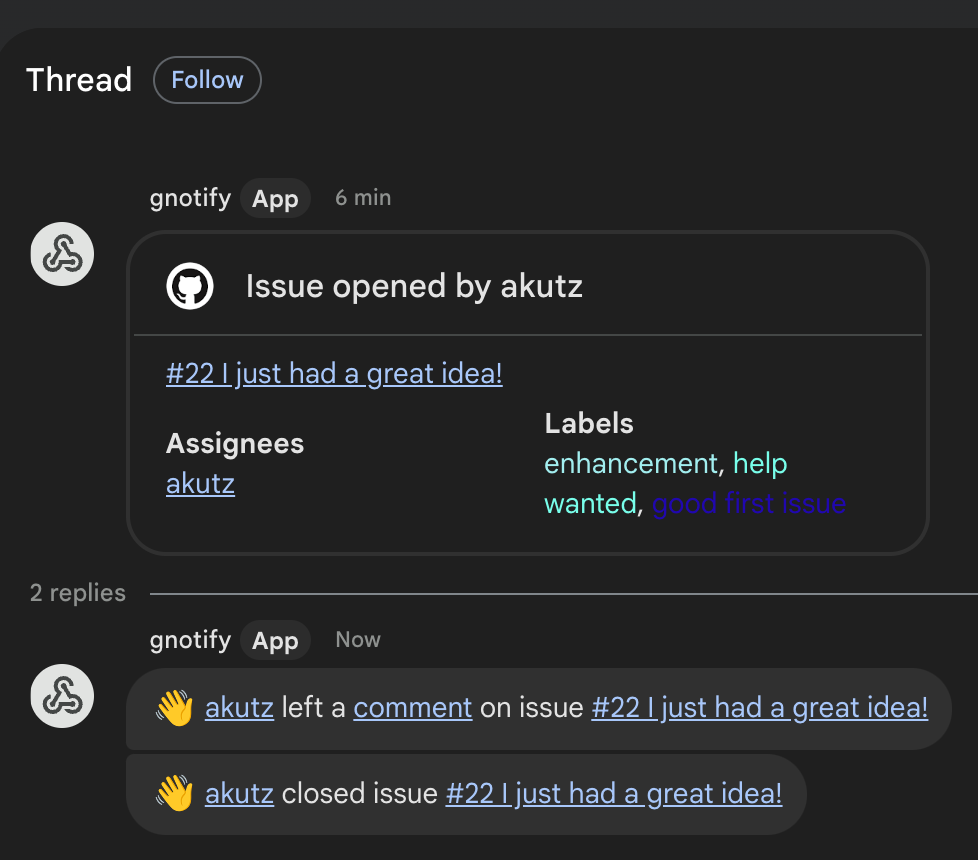

# gnotify

This repository contains a GitHub action name `gnotify` that can be used to send notifications to a Google Chat space for GitHub events such as when a new issue is created, a review is requested on a pull request, etc.

## Why not use the official GitHub integration for Google Chat?

There _is_ an official GitHub integration with Google Chat, so why would anyone use `gnotify`? If the GitHub account used to connect the a Google Chat space with GitHub has access to more than 100 repositories, and the repository to be connected to the Google Chat space is not in the those 100 repositories, then it does not work. The GitHub integration plug-in is limited to listing 100 repositories. This is a [known issue](https://support.google.com/chat/thread/237653907/github-bot-don-t-let-me-choose-a-specific-repo?hl=en) for which there is currently no fix. The response in this [bug report](https://support.google.com/chat/thread/227341091/github-app-not-showing-all-organization-repositories?hl=en) _implies_ there is a work-around, but none of the ones listed actually work. Hence, `gnotify`.

## Installation

It is easy to get started with `gnotify` with the steps below:

1. Identify the GitHub repository and Google Chat space that will send and receive the notifications.
2. Visit the Google Chat space, click on the downward arrow next to its name, and click on the menu item named _Apps & integrations_, ex.:

    

3. Click on the _Add webhooks_ button, ex.:

    

4. Fill in the details about the new webhook, ex.:

    

5. Click the _Save_ button.

6. The new webhook is listed on the screen. Click the button with the three, vertical dots to make a menu appear. Click the _Copy link_ menu item to copy the webhook's URL into the clipboard, ex.:

    

7. Visit the URL `https://github.com/<ORG_OR_USER>/<REPO_NAME>/settings/secrets/actions` to define a new repository secret by clicking on the _New repository secret_ button, ex.:

    

8. Name the new secret `GOOGLE_SPACE_URL`, paste the contents of the clipboard into the secret's value, and click the _Add secret_ button, ex.:

    

9. Create the directory structure `.github/workflows` in the target repository if it does not already exist.
10. Copy the files [`.github/workflows/gnotify.py`](./.github/workflows/gnotify.py), [`.github/workflows/gnotify.requirements`](./.github/workflows/gnotify.requirements), and [`.github/workflows/gnotify.yml`](./.github/workflows/gnotify.yml) into the target repository's `.github/workflows` directory.
11. Commit the new files to the target repository and push the changes to the repository's main branch.

That's it! The next time someone creates an issue or pull request in the target repository, the Google Chat space will receive a notification!

If there are new comments, notifications will show up as a thread under the original message, ex.:

